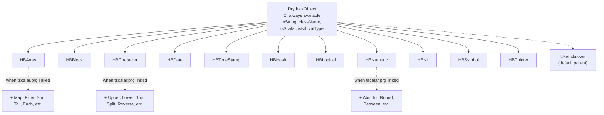
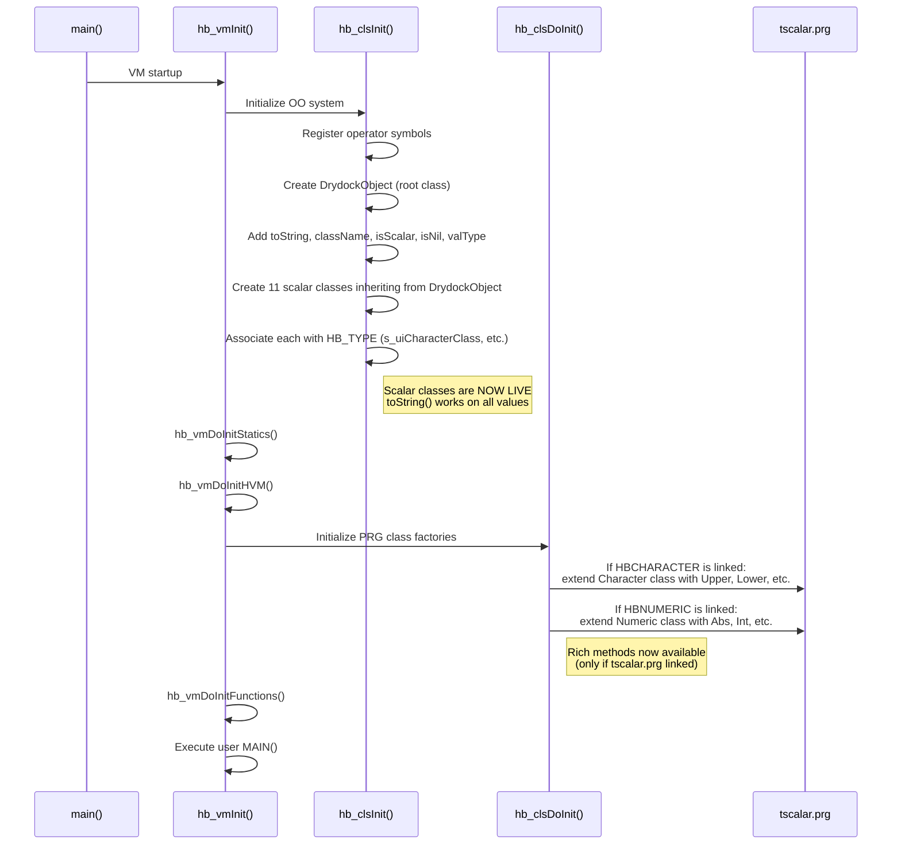
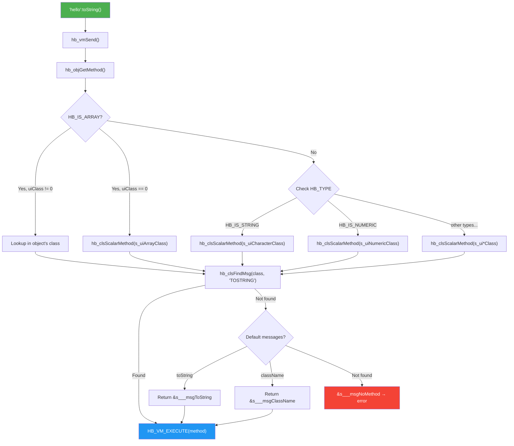

# ARCHITECTURE -- ScalarClasses (SUBSYSTEM)

## 1. Class Hierarchy

Solid arrows = C-level inheritance (always available).
Dashed arrows = PRG-level extension (when linked).

## 2. Initialization Sequence

## 3. Method Dispatch Flow

## 4. Two-Layer Method Resolution

**Layer 1 (C, always available):** DrydockObject methods are inherited by
all scalar classes. `toString()` is also a built-in default message (like
`className()`), so it works even on values whose scalar class has no explicit
toString method.

**Layer 2 (PRG, optional extension):** When `tscalar.prg` is linked, it
extends the pre-existing scalar classes with rich methods (Upper, Lower,
Split, Map, Filter, etc.) via `hb_clsAddMsg()`.

If a class defines its own `toString()`, it overrides the DrydockObject
default. This is standard method dispatch — subclass methods shadow parent
methods.

---

[<- Index](../INDEX.md) · [Map](../MAP.md) · [BRIEF](BRIEF.md) · [DESIGN](DESIGN.md) · **ARCH** · [API](C_API.md) · [COMPAT](COMPAT.md) · [PLAN](IMPLEMENTATION_PLAN.md) · [TESTS](TEST_PLAN.md) · [MATRIX](TRACEABILITY.md) · [AUDIT](AUDIT.md)
